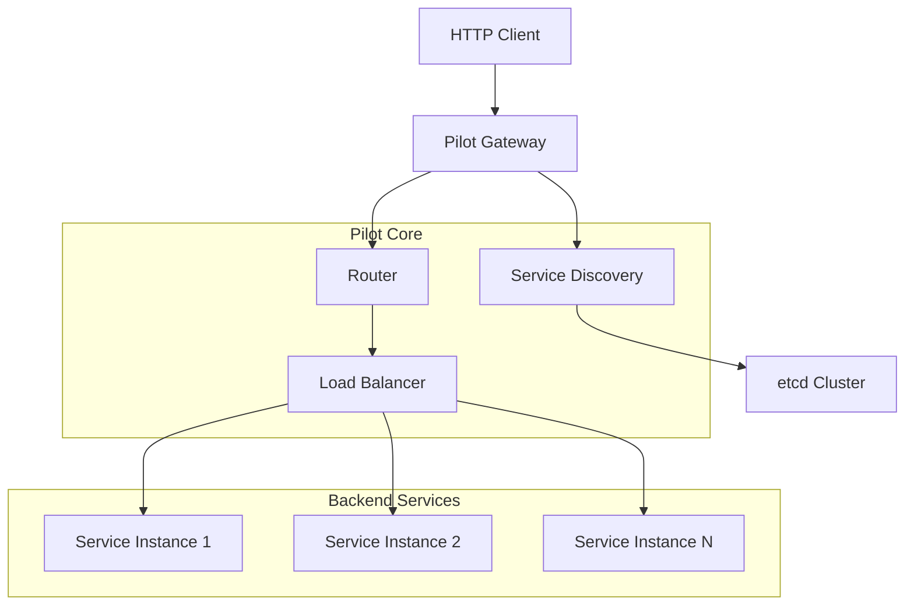

# Pilot

<div align="center">


[](https://golang.org)
[](LICENSE)
[]()

**🚀 A high-performance gRPC dynamic gateway**

It provides an intelligent proxy from HTTP to gRPC, supporting dynamic service discovery, load balancing, and automatic route generation.

</div>

## 🌐 Language / 语言

| Language | 文档 |
|----------|------|
| 🇺🇸 **English** | [English Documentation](docs/README.en.md) |
| 🇨🇳 **简体中文** | [中文文档](docs/README.zh.md) |

---

## ✨ Quick Features

### 🌐 Core Features
- **HTTP to gRPC Proxy**: Seamlessly converts HTTP requests to gRPC calls
- **Dynamic Route Generation**: Automatically generates HTTP routing rules based on protobuf annotations
- **Service Discovery**: Supports etcd as service registry
- **Load Balancing**: Intelligent load balancing based on consistent hashing
- **Hot Updates**: Service registration/deregistration without gateway restart

### 🛡️ High Availability Features
- **Health Check**: Automatically detects service instance health status
- **Failover**: Automatic switching when service instances fail
- **Connection Pool Management**: Efficient gRPC connection reuse
- **Graceful Shutdown**: Supports zero-downtime updates

### 🚀 Performance Optimizations
- **Object Pooling**: Reduces memory allocation and GC pressure
- **Concurrency Control**: Performance guarantees under high concurrency
- **Caching Mechanism**: Route information and method descriptor caching
- **Stream Processing**: Supports large file transfers

## 🏗️ Architecture Overview



## 🚀 Quick Start

### Requirements

- Go 1.25+
- etcd 3.6+
- Protocol Buffers 3.x

### Installation

```bash
# Clone the project
git clone https://github.com/kieran091/pilot.git
cd pilot

# Install dependencies
go mod tidy

# Build
go build -o pilot
```

### Basic Usage

1. **Define your gRPC service with HTTP annotations**
2. **Start your gRPC server with service registration**
3. **Launch Pilot gateway**
4. **Make HTTP requests that automatically proxy to gRPC**

For detailed documentation, please choose your language above.

## 🌳 Advanced Features

- **RCU-Based Prefix Tree**: High-performance routing with lock-free reads
- **Consistent Hashing**: Intelligent load balancing across service instances
- **Dynamic Configuration**: Hot reload of routing rules and service topology
- **Protocol Buffer Caching**: Efficient method descriptor management
- **Comprehensive Middleware**: Authentication, logging, rate limiting support

## 📄 License

This project is licensed under the MIT License - see the [LICENSE](LICENSE) file for details.

---

<div align="center">

**⭐ If this project helps you, please give us a Star!**

Made with ❤️ by [Pilot Team](https://github.com/kieran091/pilot)

</div>