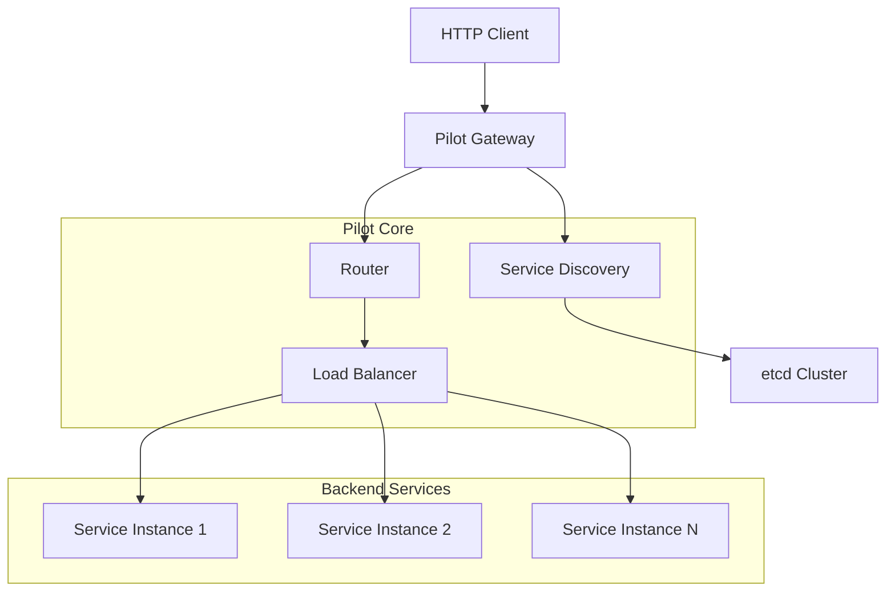

# Pilot

<div align="center">


[](https://golang.org)
[](../LICENSE)
[]()

**🚀 A high-performance gRPC dynamic gateway**

It provides an intelligent proxy from HTTP to gRPC, supporting dynamic service discovery, load balancing, and automatic route generation.

</div>

## 📖 Table of Contents

- [Features](#Features)
- [Design](#Design)
- [Quickstart](#Quickstart)
- [Configuration Guide](#Configuration Guide)
- [API Docs](#API Docs)
- [Performance Metrics](#Performance Metrics)
- [Developer Guide](#Developer Guide)
- [Contributing](#Contributing)
- [License](#License)

## ✨ Features

### 🌐 Core Features
- **HTTP to gRPC Proxy**: Seamlessly converts HTTP requests to gRPC calls
- **Dynamic Route Generation**: Automatically generates HTTP routing rules based on protobuf annotations
- **Service Discovery**: Supports etcd as service registry
- **Load Balancing**: Intelligent load balancing based on consistent hashing
- **Hot Updates**: Service registration/deregistration without gateway restart

### 🛡️ High Availability Features
- **Health Check**: Automatically detects service instance health status
- **Failover**: Automatic switching when service instances fail
- **Connection Pool Management**: Efficient gRPC connection reuse
- **Graceful Shutdown**: Supports zero-downtime updates

### 🚀 Performance Optimizations
- **Object Pooling**: Reduces memory allocation and GC pressure
- **Concurrency Control**: Performance guarantees under high concurrency
- **Caching Mechanism**: Route information and method descriptor caching
- **Stream Processing**: Supports large file transfers

## 🏗️ Architecture Design



### Core Components

| Component | Function | Description |
|-----------|----------|-------------|
| **Engine** | Gateway Engine | Core engine responsible for startup and coordination of components |
| **Router** | Route Management | Manages HTTP route to gRPC service mappings |
| **ServiceRegistry** | Service Registry | Maintains service instance information and connections |
| **Discovery** | Service Discovery | Monitors service online/offline events |
| **Invoker** | Method Invoker | Executes gRPC method calls |
| **LoadBalancer** | Load Balancer | Consistent hashing-based load balancing |

### 🌳 Advanced Routing Implementation

#### RCU-Based Prefix Tree
Pilot implements a high-performance routing tree using Read-Copy-Update (RCU) pattern for concurrent access:

- **Atomic Root Updates**: Uses `atomic.Value` for lock-free root node updates during route modifications
- **String Interning**: Implements string interning pool to reduce memory usage for repeated path segments
- **Cache Mechanism**: Built-in TTL-based lookup cache to reduce routing overhead
- **Three Node Types**: Static nodes, parameter nodes (`:param`), and wildcard nodes (`*wildcard`)
- **Concurrent Safety**: Fine-grained locking with `sync.RWMutex` for node value protection

#### Load Balancing with Consistent Hashing
- **Virtual Nodes**: Each physical service instance maps to multiple virtual nodes for better distribution
- **CRC32 Hashing**: Uses CRC32 checksum for hash calculation
- **Dynamic Ring Updates**: Hash ring automatically updates when services are added/removed
- **Failover Support**: Automatic routing to healthy instances when failures occur

## 🚀 Quickstart

### Requirements

- Go 1.25+
- etcd 3.6+
- Protocol Buffers 3.x

### Installation

```bash
# Clone the project
git clone https://github.com/kieran091/pilot.git
cd pilot

# Install dependencies
go mod tidy

# Build
go build -o pilot
```

### Basic Example

#### 1. Define gRPC Service

Create `user.proto` file:

```protobuf
syntax = "proto3";

package user;

import "google/api/annotations.proto";

message GetUserReq {
  string id = 1;
}

message GetUserResp {
  string id = 1;
  string name = 2;
}

service User {
  rpc get_user(GetUserReq) returns (GetUserResp) {
    option (google.api.http) = {
      get: "/v1/user/:id"
    };
  }
}
```

#### 2. Start gRPC Service

```go
// main.go
package main

import (
    "context"
    "log"
    "net"
    "time"
    
    "github.com/kieran091/pilot"
    "google.golang.org/grpc"
)

func main() {
    // Create service registry
    etcdRegistry, err := pilot.NewEtcdRegistry(
        []string{"127.0.0.1:2379"},
        10*time.Second,
        "services/",
    )
    if err != nil {
        log.Fatal(err)
    }
    
    // Register service
    serviceRegistrar := pilot.NewServiceRegistrar(
        "User",
        ":9001",
        etcdRegistry,
    )
    
    ctx := context.Background()
    err = serviceRegistrar.Register(
        ctx,
        pilot.WithFile("user.proto"),
        pilot.WithProtoPath("proto"),
    )
    if err != nil {
        log.Fatal(err)
    }
    
    // Start gRPC server
    lis, err := net.Listen("tcp", ":9001")
    if err != nil {
        log.Fatal(err)
    }
    
    s := grpc.NewServer()
    // Register your gRPC service implementation...
    
    log.Println("gRPC server started on :9001")
    s.Serve(lis)
}
```

#### 3. Start Pilot Gateway

```go
// gateway.go
package main

import (
    "context"
    "log"
    "time"
    
    "github.com/kieran091/pilot"
)

func main() {
    cfg := pilot.Config{
        HTTP: pilot.HTTPConfig{
            Addr:           ":8080",
            ReadTimeout:    30 * time.Second,
            WriteTimeout:   30 * time.Second,
            MaxHeaderBytes: 1 << 20,
            MaxBodyBytes:   10 << 20,
        },
        Discovery: pilot.DiscoveryConfig{
            Mode: pilot.Etcd,
            Etcd: &pilot.EtcdConfig{
                Endpoints:     []string{"127.0.0.1:2379"},
                DiscoveryPath: "services/",
                DialTimeout:   5 * time.Second,
            },
        },
    }
    
    engine, err := pilot.NewEngine(cfg)
    if err != nil {
        log.Fatal(err)
    }
    
    // Add middleware
    engine.Use(
        pilot.Recovery(),    // Exception recovery
        pilot.Log(),          // Request logging
    )
    
    log.Println("Pilot gateway started on :8080")
    if err := engine.Start(); err != nil {
        log.Fatal(err)
    }
}
```

#### 4. Make HTTP Request

```bash
# Start the gateway and access HTTP API
curl http://localhost:8080/v1/user/123

# Response example
{
  "code": 200,
  "message": "ok",
  "data": {
    "id": "123",
    "name": "User-123"
  }
}
```

## 🔧 Configuration Guide

### HTTP Configuration

```go
type HTTPConfig struct {
    Addr           string        // Server listen address (default: ":8080")
    ReadTimeout    time.Duration // Read timeout (default: 15s)
    WriteTimeout   time.Duration // Write timeout (default: 15s)
    MaxHeaderBytes int          // Maximum header bytes (default: 1MB)
    MaxBodyBytes   int          // Maximum body bytes (default: 10MB)
}
```

### Service Discovery Configuration

```go
type DiscoveryConfig struct {
    Mode string     // Discovery mode: "etcd" (default: "etcd")
    Etcd *EtcdConfig // etcd specific configuration
}

type EtcdConfig struct {
    Endpoints     []string      // etcd endpoints (default: ["localhost:2379"])
    DiscoveryPath string        // Discovery path prefix (default: "/services/")
    DialTimeout   time.Duration // Connection timeout (default: 5s)
}
```

## 📚 API Documentation

### HTTP Request Mapping

Pilot supports gRPC-Gateway annotations to automatically map HTTP requests to gRPC methods:

```protobuf
service UserService {
    rpc GetUser(GetUserRequest) returns (GetUserResponse) {
        option (google.api.http) = {
            get: "/v1/users/:user_id"
        };
    }
    
    rpc CreateUser(CreateUserRequest) returns (CreateUserResponse) {
        option (google.api.http) = {
            post: "/v1/users"
            body: "*"
        };
    }
    
    rpc UpdateUser(UpdateUserRequest) returns (UpdateUserResponse) {
        option (google.api.http) = {
            put: "/v1/users/:user_id"
            body: "user"
        };
    }
}
```

### Request Parameter Mapping

| HTTP Location | gRPC Field | Description                           |
|---------------|------------|---------------------------------------|
| URL Path Parameters | Corresponding Field | `:user_id` → `user_id`                |
| Query Parameters | Corresponding Field | `?name=xxx` → `name`                  |
| Request Body | Specified Field | `body: "*"` maps all fields           |
| Headers | Metadata | Automatically passed to gRPC metadata |

### Response Format

```json
{
  "code": 200,
  "message": "ok",
  "data": {
    // gRPC response data
  }
}
```

Error response format:

```json
{
  "code": 500,
  "message": "Internal Server Error",
  "data": null
}
```

## 🛠️ Developer Guide

### Middleware Usage

```go
// Custom middleware
func AuthMiddleware() pilot.HandlerFunc {
    return func(c *pilot.Context) {
        token := c.Request.Header.Get("Authorization")
        if token == "" {
            c.Writer.WriteJSON(401, map[string]interface{}{
                "code": 401,
                "message": "Unauthorized",
            })
            c.Abort()
            return
        }
        c.Next()
    }
}

// Use middleware
engine.Use(
    pilot.Recovery(),
    pilot.Log(),
    AuthMiddleware(),
)
```

### Health Check

```go
// Health check endpoint
engine.router.GET("/health", func(c *pilot.Context) {
    c.Writer.WriteJSON(200, map[string]interface{}{
        "status": "ok",
        "timestamp": time.Now().Unix(),
    })
})
```

## 🔍 Advanced Features

### Hot Configuration Reload
- Routes automatically update when services register/deregister
- No gateway restart required for topology changes
- Graceful handling of configuration conflicts

### Protocol Buffer Caching
- File descriptors cached in memory for fast method resolution
- Base64 encoding for efficient storage in etcd
- Dynamic message creation using `dynamicpb`

### Error Handling
- Comprehensive error mapping between HTTP and gRPC status codes
- Automatic retry with exponential backoff
- Circuit breaker pattern integration support

## 🤝 Contributing

We welcome all forms of contributions! Please read the following guidelines:

### Submitting Pull Requests

1. Fork this repository
2. Create your feature branch: `git checkout -b feature/amazing-feature`
3. Commit your changes: `git commit -m 'Add amazing feature'`
4. Push to the branch: `git push origin feature/amazing-feature`
5. Submit a Pull Request

### Code Standards

- Follow Go official coding standards
- Use `gofmt` to format code
- Add appropriate comments and documentation
- Ensure test coverage > 80%

### Issue Reporting

If you find an issue, please submit an Issue including:

- Detailed problem description
- Reproduction steps
- Environment information (Go version, OS, etc.)
- Relevant logs and error messages

## 🗺️ Roadmap

- [ ] Support more service discovery mechanisms (Consul, Nacos)
- [ ] Add monitoring metrics (Prometheus)
- [ ] Support distributed tracing (Jaeger, OpenTelemetry)
- [ ] Implement gRPC streaming proxy
- [ ] Add Web management interface
- [ ] Support plugin mechanism

## 📄 License

This project is licensed under the [MIT License](../LICENSE).

---

<div align="center">

**⭐ If this project helps you, please give us a Star!**

Made with ❤️ by [Pilot Team](https://github.com/kieran091/pilot)

</div>