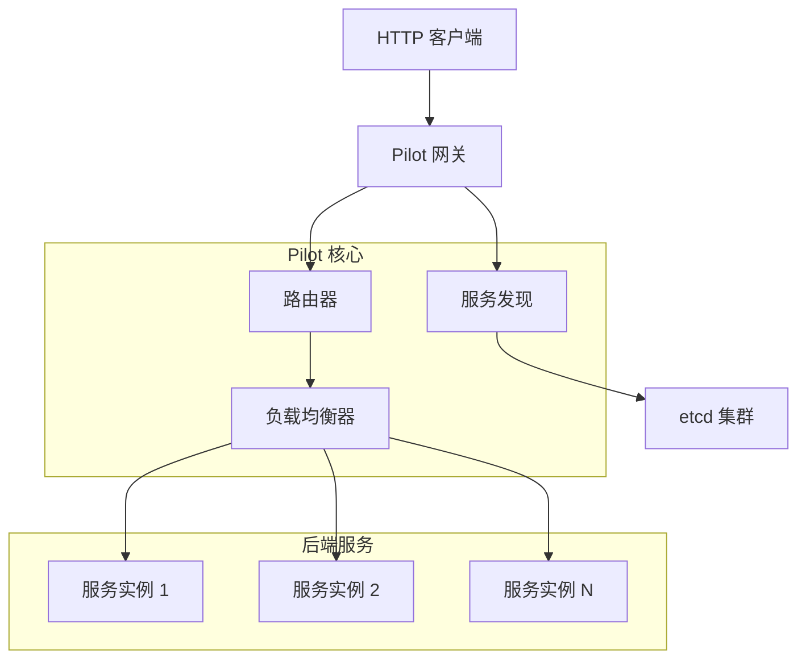

# Pilot

<div align="center">


[](https://golang.org)
[](../LICENSE)
[]()

**🚀 高性能 gRPC 动态网关**

它提供从 HTTP 到 gRPC 的智能代理，支持动态服务发现、负载均衡和自动路由生成。

</div>

## 📖 目录

- [功能特性](#功能特性)
- [架构设计](#架构设计)
- [快速开始](#快速开始)
- [配置指南](#配置指南)
- [API 文档](#api-文档)
- [性能指标](#性能指标)
- [开发者指南](#开发者指南)
- [贡献指南](#贡献指南)
- [许可证](#许可证)

## ✨ 功能特性

### 🌐 核心功能
- **HTTP 到 gRPC 代理**：无缝将 HTTP 请求转换为 gRPC 调用
- **动态路由生成**：基于 protobuf 注解自动生成 HTTP 路由规则
- **服务发现**：支持 etcd 作为服务注册中心
- **负载均衡**：基于一致性哈希的智能负载均衡
- **热更新**：服务上下线无需重启网关

### 🛡️ 高可用特性
- **健康检查**：自动检测服务实例健康状态
- **故障转移**：服务实例故障时自动切换
- **连接池管理**：高效的 gRPC 连接复用
- **优雅关闭**：支持零停机更新

### 🚀 性能优化
- **对象池化**：减少内存分配和 GC 压力
- **并发控制**：高并发场景下的性能保证
- **缓存机制**：路由信息和方法描述符缓存
- **流式处理**：支持大文件传输

## 🏗️ 架构设计



### 核心组件

| 组件 | 功能 | 描述 |
|------|------|------|
| **Engine** | 网关引擎 | 核心引擎，负责启动和协调各个组件 |
| **Router** | 路由管理 | 管理 HTTP 路由到 gRPC 服务的映射关系 |
| **ServiceRegistry** | 服务注册表 | 维护服务实例信息和连接 |
| **Discovery** | 服务发现 | 监控服务上下线事件 |
| **Invoker** | 调用器 | 执行 gRPC 方法调用 |
| **LoadBalancer** | 负载均衡器 | 基于一致性哈希的负载均衡 |

### 🌳 高级路由实现

#### RCU 前缀树
Pilot 使用读-拷贝-更新（RCU）模式实现高性能路由树以支持并发访问：

- **原子根更新**：使用 `atomic.Value` 在路由修改期间进行无锁根节点更新
- **字符串驻留**：实现字符串驻留池以减少重复路径段的内存使用
- **缓存机制**：内置基于 TTL 的查找缓存以减少路由开销
- **三种节点类型**：静态节点、参数节点（`:param`）和通配符节点（`*wildcard`）
- **并发安全**：使用 `sync.RWMutex` 进行节点值的细粒度锁定

#### 一致性哈希负载均衡
- **虚拟节点**：每个物理服务实例映射到多个虚拟节点以获得更好的分布
- **CRC32 哈希**：使用 CRC32 校验和进行哈希计算
- **动态环更新**：当服务添加/移除时哈希环自动更新
- **故障转移支持**：故障时自动路由到健康实例

## 🚀 快速开始

### 环境要求

- Go 1.25+
- etcd 3.6+
- Protocol Buffers 3.x

### 安装

```bash
# 克隆项目
git clone https://github.com/kieran091/pilot.git
cd pilot

# 安装依赖
go mod tidy

# 编译
go build -o pilot
```

### 基础示例

#### 1. 定义 gRPC 服务

创建 `user.proto` 文件：

```protobuf
syntax = "proto3";

package user;

import "google/api/annotations.proto";

message GetUserReq {
  string id = 1;
}

message GetUserResp {
  string id = 1;
  string name = 2;
}

service User {
  rpc get_user(GetUserReq) returns (GetUserResp) {
    option (google.api.http) = {
      get: "/v1/user/:id"
    };
  }
}
```

#### 2. 启动 gRPC 服务

```go
// main.go
package main

import (
    "context"
    "log"
    "net"
    "time"
    
    "github.com/kieran091/pilot"
    "google.golang.org/grpc"
)

func main() {
    // 创建服务注册器
    etcdRegistry, err := pilot.NewEtcdRegistry(
        []string{"127.0.0.1:2379"},
        10*time.Second,
        "services/",
    )
    if err != nil {
        log.Fatal(err)
    }
    
    // 注册服务
    serviceRegistrar := pilot.NewServiceRegistrar(
        "User",
        ":9001",
        etcdRegistry,
    )
    
    ctx := context.Background()
    err = serviceRegistrar.Register(
        ctx,
        pilot.WithFile("user.proto"),
        pilot.WithProtoPath("proto"),
    )
    if err != nil {
        log.Fatal(err)
    }
    
    // 启动 gRPC 服务器
    lis, err := net.Listen("tcp", ":9001")
    if err != nil {
        log.Fatal(err)
    }
    
    s := grpc.NewServer()
    // 注册你的 gRPC 服务实现...
    
    log.Println("gRPC 服务器启动在 :9001")
    s.Serve(lis)
}
```

#### 3. 启动 Pilot 网关

```go
// gateway.go
package main

import (
    "context"
    "log"
    "time"
    
    "github.com/kieran091/pilot"
)

func main() {
    cfg := pilot.Config{
        HTTP: pilot.HTTPConfig{
            Addr:           ":8080",
            ReadTimeout:    30 * time.Second,
            WriteTimeout:   30 * time.Second,
            MaxHeaderBytes: 1 << 20,
            MaxBodyBytes:   10 << 20,
        },
        Discovery: pilot.DiscoveryConfig{
            Mode: pilot.Etcd,
            Etcd: &pilot.EtcdConfig{
                Endpoints:     []string{"127.0.0.1:2379"},
                DiscoveryPath: "services/",
                DialTimeout:   5 * time.Second,
            },
        },
    }
    
    engine, err := pilot.NewEngine(cfg)
    if err != nil {
        log.Fatal(err)
    }
    
    // 添加中间件
    engine.Use(
        pilot.Recovery(),    // 异常恢复
        pilot.Log(),          // 请求日志
    )
    
    log.Println("Pilot 网关启动在 :8080")
    if err := engine.Start(); err != nil {
        log.Fatal(err)
    }
}
```

#### 4. 测试 API

```bash
# 启动网关后，访问 HTTP API
curl http://localhost:8080/v1/user/123

# 响应示例
{
  "code": 200,
  "message": "ok",
  "data": {
    "id": "123",
    "name": "User-123"
  }
}
```

## 🔧 配置指南

### HTTP 配置

```go
type HTTPConfig struct {
    Addr           string        // 服务器监听地址（默认: ":8080"）
    ReadTimeout    time.Duration // 读取超时（默认: 15s）
    WriteTimeout   time.Duration // 写入超时（默认: 15s）
    MaxHeaderBytes int          // 最大请求头字节（默认: 1MB）
    MaxBodyBytes   int          // 最大请求体字节（默认: 10MB）
}
```

### 服务发现配置

```go
type DiscoveryConfig struct {
    Mode string     // 发现模式: "etcd"（默认: "etcd"）
    Etcd *EtcdConfig // etcd 特定配置
}

type EtcdConfig struct {
    Endpoints     []string      // etcd 端点（默认: ["localhost:2379"]）
    DiscoveryPath string        // 发现路径前缀（默认: "/services/"）
    DialTimeout   time.Duration // 连接超时（默认: 5s）
}
```

## 📚 API 文档

### HTTP 请求映射

Pilot 支持 gRPC-Gateway 注解，自动将 HTTP 请求映射到 gRPC 方法：

```protobuf
service UserService {
    rpc GetUser(GetUserRequest) returns (GetUserResponse) {
        option (google.api.http) = {
            get: "/v1/users/:user_id"
        };
    }
    
    rpc CreateUser(CreateUserRequest) returns (CreateUserResponse) {
        option (google.api.http) = {
            post: "/v1/users"
            body: "*"
        };
    }
    
    rpc UpdateUser(UpdateUserRequest) returns (UpdateUserResponse) {
        option (google.api.http) = {
            put: "/v1/users/:user_id"
            body: "user"
        };
    }
}
```

### 请求参数映射

| HTTP 位置 | gRPC 字段 | 说明                     |
|-----------|-----------|------------------------|
| URL 路径参数 | 对应字段 | `:user_id` → `user_id` |
| Query 参数 | 对应字段 | `?name=xxx` → `name`   |
| Request Body | 指定字段 | `body: "*"` 映射所有字段     |
| Headers | Metadata | 自动传递到 gRPC metadata    |

### 响应格式

```json
{
  "code": 200,
  "message": "ok",
  "data": {
    // gRPC 响应数据
  }
}
```

错误响应格式：

```json
{
  "code": 500,
  "message": "Internal Server Error",
  "data": null
}
```

## 🛠️ 开发者指南

### 中间件使用

```go
// 自定义中间件
func AuthMiddleware() pilot.HandlerFunc {
    return func(c *pilot.Context) {
        token := c.Request.Header.Get("Authorization")
        if token == "" {
            c.Writer.WriteJSON(401, map[string]interface{}{
                "code": 401,
                "message": "Unauthorized",
            })
            c.Abort()
            return
        }
        c.Next()
    }
}

// 使用中间件
engine.Use(
    pilot.Recovery(),
    pilot.Log(),
    AuthMiddleware(),
)
```

### 健康检查

```go
// 健康检查端点
engine.router.GET("/health", func(c *pilot.Context) {
    c.Writer.WriteJSON(200, map[string]interface{}{
        "status": "ok",
        "timestamp": time.Now().Unix(),
    })
})
```

## 🔍 高级功能

### 热配置重载
- 服务注册/注销时路由自动更新
- 拓扑变更无需网关重启
- 优雅处理配置冲突

### Protocol Buffer 缓存
- 文件描述符缓存在内存中以加快方法解析
- Base64 编码以在 etcd 中高效存储
- 使用 `dynamicpb` 进行动态消息创建

### 错误处理
- HTTP 和 gRPC 状态码之间的全面错误映射
- 指数退避的自动重试
- 断路器模式集成支持

## 🤝 贡献指南

我们欢迎所有形式的贡献！请阅读以下指南：

### 提交 Pull Request

1. Fork 本仓库
2. 创建特性分支：`git checkout -b feature/amazing-feature`
3. 提交更改：`git commit -m 'Add amazing feature'`
4. 推送分支：`git push origin feature/amazing-feature`
5. 提交 Pull Request

### 代码规范

- 遵循 Go 官方代码规范
- 使用 `gofmt` 格式化代码
- 添加适当的注释和文档
- 确保测试覆盖率 > 80%

### 问题报告

如果发现问题，请提交 Issue 并包含：

- 详细的问题描述
- 复现步骤
- 环境信息（Go 版本、操作系统等）
- 相关日志和错误信息

## 🗺️ 路线图

- [ ] 支持更多服务发现机制（Consul、Nacos）
- [ ] 添加监控指标（Prometheus）
- [ ] 支持链路追踪（Jaeger、OpenTelemetry）
- [ ] 实现 gRPC 流式代理
- [ ] 添加 Web 管理界面
- [ ] 支持插件机制

## 📄 许可证

本项目采用 [MIT 许可证](../LICENSE)。

---

<div align="center">

**⭐ 如果这个项目对你有帮助，请给我们一个 Star！**

由 [Pilot Team](https://github.com/kieran091/pilot) 用 ❤️ 制作

</div>